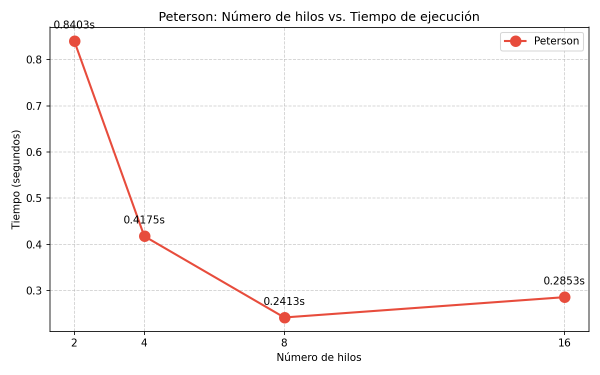

# Práctica 04: Algoritmo de Peterson con Monte Carlo

## ¿Qué hicimos?

Calculamos π con el método Monte Carlo (el de tirar dardos a un cuadrado
con un círculo dentro) usando varios hilos al mismo tiempo. La diferencia
con prácticas anteriores es que aquí NO usamos semáforos ni mutex: usamos
el **algoritmo de Peterson** para que los hilos no se pisaran al escribir
la variable compartida `puntosDentro`.

## Resultados

| Hilos | Puntos | π calculado | Error | Tiempo (s) | Speedup |
|------:|-------:|------------:|------:|-----------:|:-------:|
| 2 | 100,000,000 | 3.141593 | 0.000001 | 0.840285 | 1.00x |
| 4 | 100,000,000 | 3.141608 | 0.000016 | 0.417484 | 2.01x |
| 8 | 100,000,000 | 3.141430 | 0.000163 | 0.241340 | 3.48x |
| 16 | 100,000,000 | 3.141389 | 0.000204 | 0.285300 | 2.95x |

## Gráfica

## ¿Cómo funciona Peterson? 

Imagínate que dos personas quieren entrar a un baño con una sola puerta.
Para no entrar al mismo tiempo, hacen esto:

- Cada quien levanta una **bandera** cuando quiere entrar.
- Hay un **letrero de turno** que dice "le toca a esta persona".
- Antes de entrar, cada quien le pasa el turno al otro.
- Luego revisa: si el otro también tiene su bandera levantada Y el
  letrero dice que es su turno, entonces espero.
- Cuando termino, bajo mi bandera y ya puede entrar el otro.

Así nunca entran los dos al mismo tiempo. Eso es Peterson: puro software,
sin trampas del CPU, solo banderas y un turno compartido.

Para más de 2 hilos se complica un poco (se hace por niveles), pero la
idea es la misma: cada hilo va subiendo de nivel hasta llegar a la
sección crítica, y al salir baja todos sus niveles.

## Conclusión

El mejor tiempo lo dio **8 hilos** con 0.241 segundos, casi 3.5 veces
más rápido que con 2 hilos. Pero con **16 hilos empeoró** (0.285 s).

¿Por qué? Porque Peterson usa **espera ocupada**: mientras un hilo
espera su turno, se queda dando vueltas consumiendo CPU en lugar de
dejar libre el procesador. Cuando pones más hilos que núcleos tiene tu
máquina, todos se pelean por el CPU y el tiempo que se pierde
coordinándose es mayor que el que se gana calculando.
