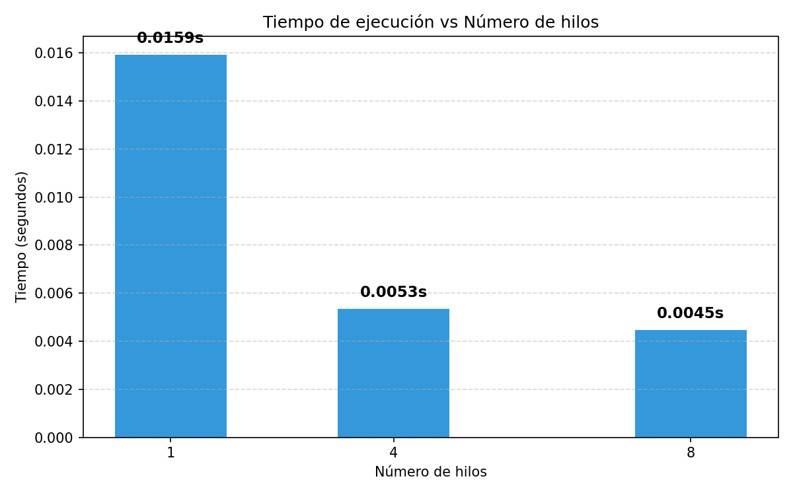
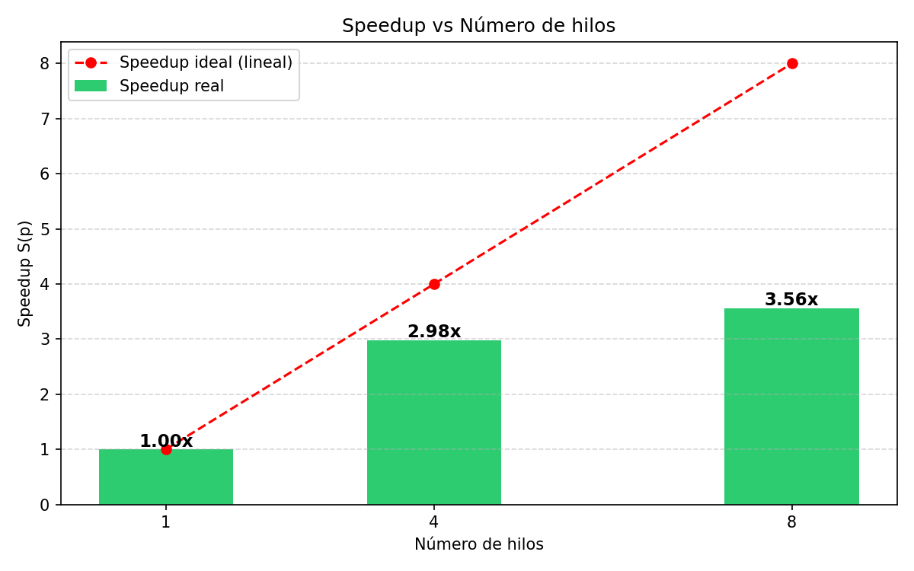
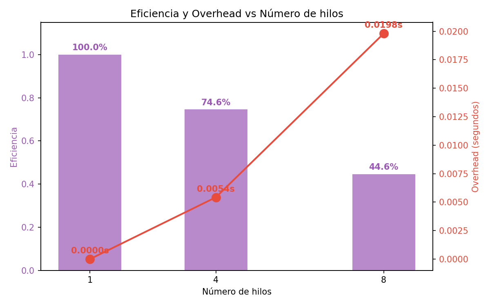

# Práctica 05: Speedup, eficiencia y overhead

## ¿Qué hicimos?

Reusamos el programa de Monte Carlo con hilos que ya habíamos hecho
(`pi_hilos.c`) y lo corrimos con 1, 4 y 8 hilos para medir qué tan bien
se aprovecha el paralelismo.

## Resultados

| Hilos | Tiempo (s) | Speedup | Eficiencia | Overhead (s) |
|------:|-----------:|--------:|-----------:|-------------:|
| 1 | 0.015912 | 1.00 | 100.0% | 0.000000 |
| 4 | 0.005334 | 2.98 | 74.6% | 0.005424 |
| 8 | 0.004464 | 3.56 | 44.6% | 0.019800 |

## ¿Qué significan las métricas?

- **Speedup:** cuántas veces más rápido va con p hilos respecto a 1.
  Con 4 hilos fue 2.98x (casi el ideal de 4) y con 8 hilos fue 3.56x
  (bastante lejos del ideal de 8).

- **Eficiencia:** qué porcentaje del paralelismo ideal estamos
  aprovechando. Con 4 hilos fue 74.6%, con 8 hilos bajó a 44.6%. Es
  decir, entre más hilos, menos provecho sacamos de cada uno.

- **Overhead:** el tiempo "perdido" coordinando hilos (creación,
  sincronización con el semáforo, cambios de contexto). Subió de
  0.0054 s con 4 hilos a 0.0198 s con 8 hilos.

## Gráficas

### Tiempo de ejecución

### Speedup

### Eficiencia y Overhead

## Conclusión

Los resultados muestran lo típico del paralelismo: al principio agregar
hilos ayuda mucho (con 4 hilos casi duplicamos el rendimiento), pero
llega un punto donde ya no conviene. Con 8 hilos la ganancia es mucho
menor que el doble de 4, la eficiencia cae a menos de la mitad y el
overhead se dispara.

Esto pasa porque la máquina tiene núcleos limitados y los hilos extra
solo se estorban entre sí: el sistema operativo se la pasa cambiando
de contexto, y el semáforo (aunque sea rápido) serializa un poco la
parte final de cada hilo. Es la famosa **Ley de Amdahl**: no importa
cuántos hilos pongas, la parte que no se puede paralelizar limita el
speedup máximo.